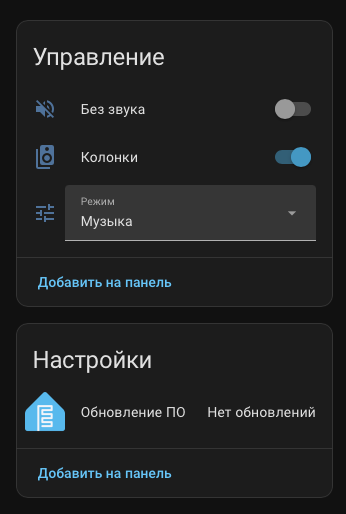
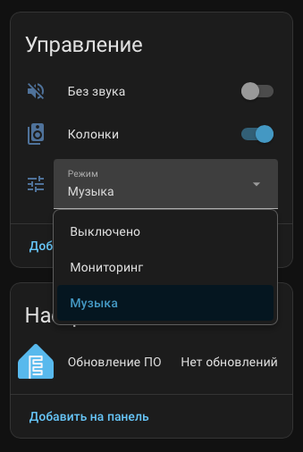

# Edifier MR4 Smart Controller (ESPHome)

External control device for **Edifier MR4** studio monitors that connects to the stock encoder button **and** the status LEDs via optocouplers, simulating button presses and reading the LED states with full galvanic isolation. Enables seamless integration with Home Assistant.

[🇷🇺 Русская версия](README_ru.md)

## ✨ Features

- **Complete Galvanic Isolation** – both button control and LED feedback are optically isolated from the speaker's internal circuitry.
- **Self‑Powered** – ESP32‑C6 runs from an independent 3.3 V mini PSU, neatly housed inside the speaker enclosure.
- **Power On/Off** – emulates long press to turn speakers on or off.
- **Mode Selection** – switches between `Music` and `Monitoring` modes (double‑click simulation).
- **Mute** – toggles mute function with a short press, while the LED blinks accordingly.
- **True State Sync** – reads the actual LED status (red/green) via isolated inputs to keep HA in sync, even when the physical button is used.
- **Blink Detection** – intelligently detects blinking LEDs to report mute state accurately.
- **Optimistic UI** – instant feedback in Home Assistant, with self‑correction if commands fail.
- **Thread / Matter Ready** – uses OpenThread for future Matter integration (ESP32‑C6).

## 🔧 How It Works

The device is wired in parallel with the encoder button and the red/green LEDs of the Edifier MR4. **All connections use optocouplers** to ensure complete electrical isolation. The ESP32‑C6 is powered by a dedicated 3.3 V supply (e.g., small AC‑DC module) mounted inside the speaker cabinet. Commands from Home Assistant trigger simulated button presses of varying lengths:

| Action          | Simulation          |
|-----------------|---------------------|
| Power On/Off    | Long press (~2 s)   |
| Toggle Mute     | Short press (~150 ms)|
| Change Mode     | Double short press  |

LED states are monitored through additional optocouplers, allowing the ESP32‑C6 to detect steady glow (mode indication) and blinking (mute active) without any electrical connection to the speaker's internal voltages.

## 📦 Hardware Requirements

- **ESP32‑C6** development board (e.g., ESP32‑C6‑DevKitC‑1)
- **3× PC817 Optocouplers** (or equivalent) – one for button simulation, two for LED sensing
- **Resistors** 220–470 Ω (for optocoupler LEDs)
- **Independent 3.3 V power supply** (small AC‑DC module or DC‑DC converter, placed inside the speaker)

## 🖧 Wiring Diagram

| ESP32‑C6 Pin | Signal               | Edifier MR4 Connection (via optocoupler)          |
|--------------|----------------------|---------------------------------------------------|
| GPIO19       | Red LED sense        | Optocoupler input → red LED anode/cathode         |
| GPIO18       | Green LED sense      | Optocoupler input → green LED anode/cathode       |
| GPIO20       | Button control       | Optocoupler output in parallel with encoder button|

> ⚠️ **Important:** All connections to the speaker are made **through optocouplers**. Do not directly connect GPIO pins to the speaker circuitry. The ESP32‑C6 is powered by its own isolated 3.3 V supply – do **not** draw power from the speaker's internal rails.

## 🧩 ESPHome Configuration

The full YAML configuration is available in [`edifier-mr4.yaml`](edifier-mr4.yaml). Key components:

- `globals` for mode tracking and mute state.
- `binary_sensor` to read LED states (via optocouplers) with blink detection.
- `interval` that analyses LED toggling to detect mute blinking.
- `switch` entities for power and mute.
- `select` entity for mode switching.

## 🚀 Installation

1. **Flash ESPHome** to your ESP32‑C6 using the ESPHome Dashboard or `esphome run`.
2. **Assemble the hardware** inside the speaker cabinet – connect optocouplers to the button and LED pads, and provide 3.3 V power to the ESP32‑C6.
3. **Add the device** to Home Assistant – it will be auto‑discovered via the ESPHome integration.
4. Control your MR4 monitors from HA dashboards, automations, or voice assistants!

### 📸 Screenshots

## 📄 License

MIT © 2026 [F-Lab]
Made with ❤️ by f1x6r
